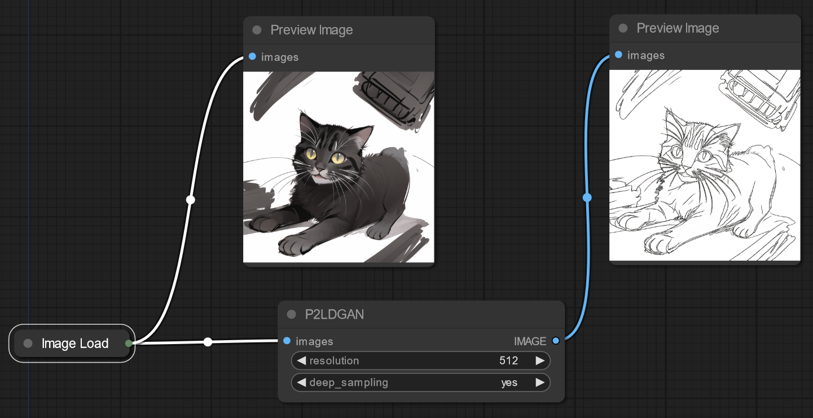

# ComfyUI - P2LDGAN Node



This integrates [P2LDGAN](https://github.com/cnyvfang/P2LDGAN/) into ComfyUI. P2LDGAN extracts lineart from input images.

## Usage

[Download the checkpoint](https://github.com/cnyvfang/P2LDGAN/), then place it in:

```
ComfyUI/custom_nodes/comfyui-p2ldgan/checkpoints
```
